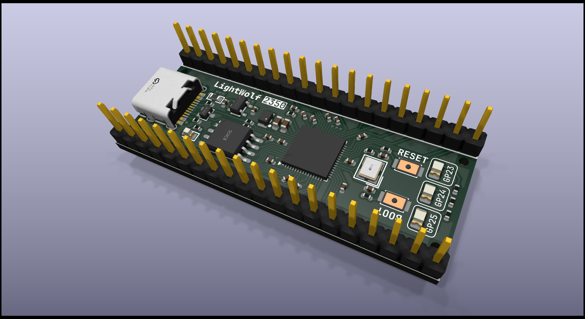

# LightWolf

> Sponsored by [Hack Club Blueprint](https://blueprint.hackclub.com/r/137?ref=r) program
> 
> To meet program requirements, `JOURNAL.md` and `bom.csv` files are included in this repository root.

LightWolf is a recreate version of Raspberry Pi Pico development board created by me. It's used to experiment with PCB designing and electronics.

Currently, LightWolf comes with following vairants:
- **LightWolf 2350** (`/2350`): Raspberry Pi RP2350 based development board with 4 MB of flash, USB C connector, a bunch of GPIO pins and 3 user LEDs.
  

> Depending on my free time, I may create more variants of LightWolf in the future.
