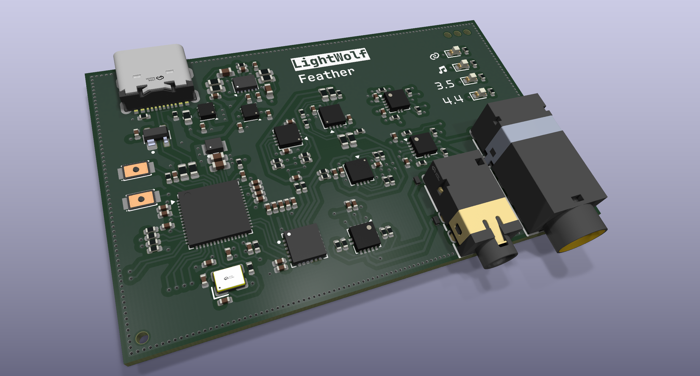
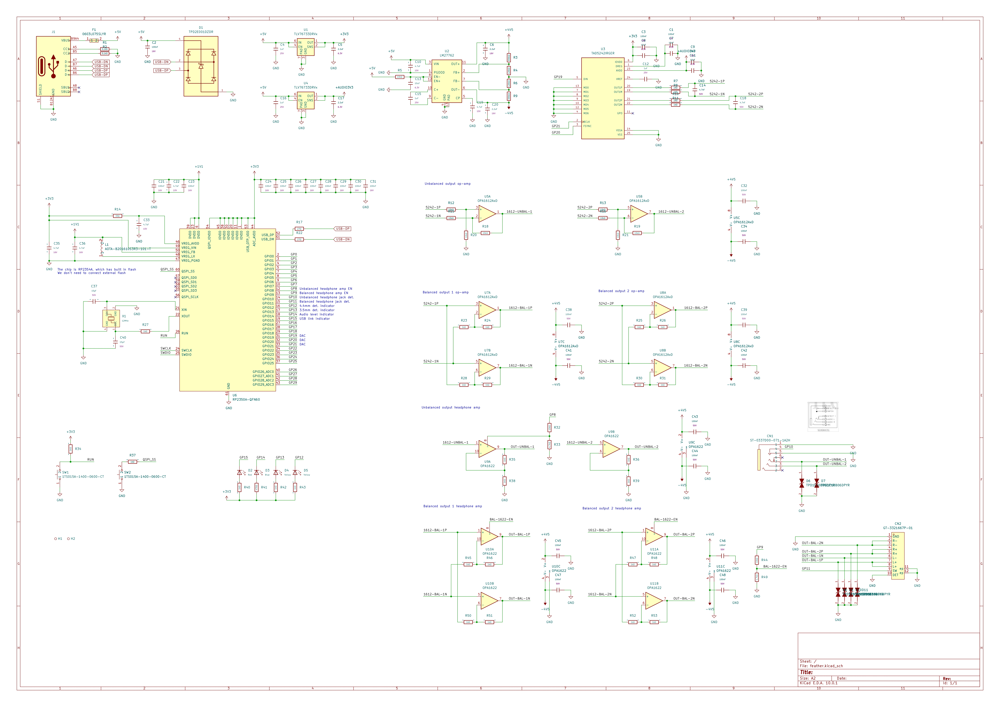
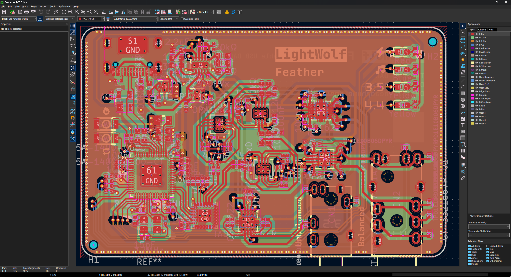

# Feather

A USB DAC that provides even better audio quality compared to Pumper. Since I want to make the board as small as possible, the board itself is only 6x4 cm.

This board has two outputs: One is 3.5mm unbalanced output, another one is 4.4mm balanced, for headphone that supports this and it can provide more power through this port.

## Why Feather?

Due to being *half* Hi-Fi fan, I want to try out some new method to get better audio. Like previous project Pumper, already got amazing power to drive headphone. Though it has some flaw and I think it's got not very balanced sound profile.

Feather is aimed to elimate the problem encountered on Pumper, with improved DAC and op-amp and one more balanced output. It should be a lot better at driving headphone and provide good audio.

## Images

> It's a 4 layer board, with dedicated GND plane and power plane.

## BOM

| Name         | Cost        |
| ------------ | ----------- |
| PCB Shipping | $4.86       |
| PCB Assambly | $117.63     |
| PCB          | $7.00       |
| Coupon       | $-9.00      |
| **Total**    | **$120.49** |