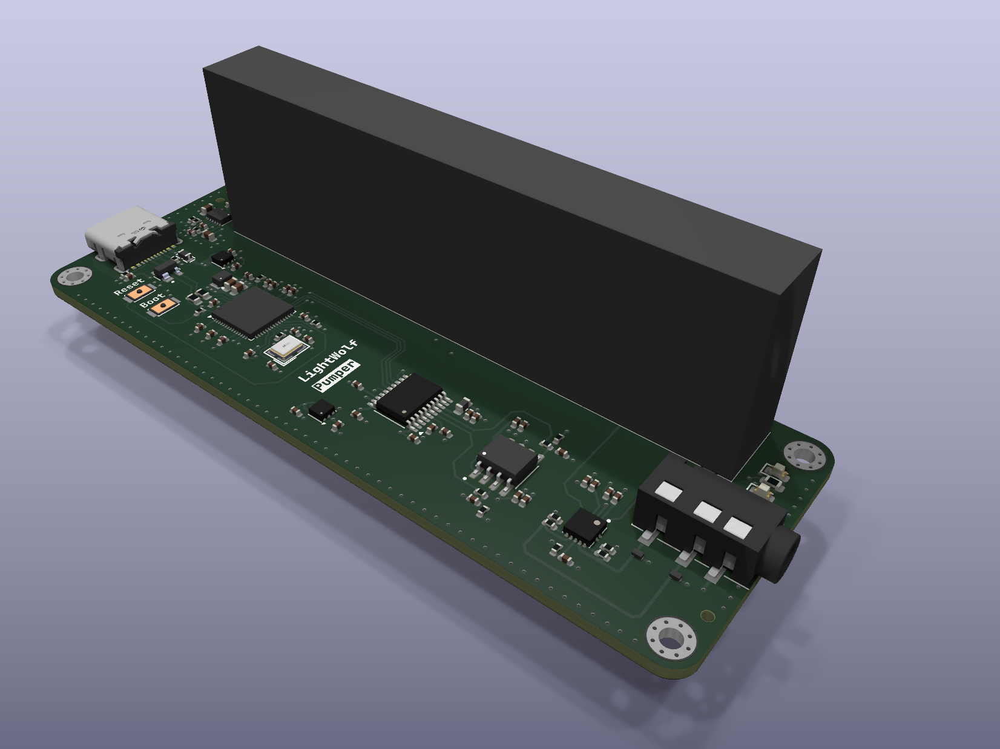
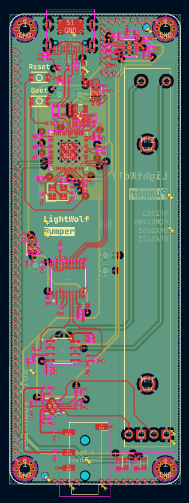

# Pumper

A USB DAC that uses RP2350 to pump audio data to a DAC chip. The board uses PCM5102A DAC with OPA1652 and OPA1622 as op-amp and headphone driver.

This is a experimental project to learn about USB audio and DAC design. The board is designed to be as simple as possible, with minimal components and a small form factor while trying to give best audio quality.

## BOM

| Name         | Cost        |
| ------------ | ----------- |
| PCB Shipping | $6.12       |
| PCB Assambly | $86.18      |
| PCB          | $11.43      |
| **Total**    | **$103.73** |
