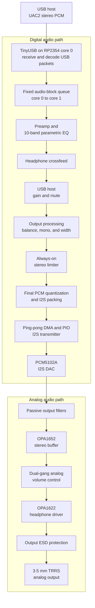

# Pumper

Pumper is an experimental RP2354-based USB Audio Class 2 DAC. The board uses a
PCM5102A DAC with OPA1652 and OPA1622 analog stages in a compact design intended
for learning about USB audio and DAC hardware.

The firmware provides a ten-band parametric EQ, headphone crossfeed, output
processing, USB host volume and mute, and persistent EQ profiles. Settings can
be controlled from either the React WebHID controller or the native Android
controller. Both controllers preview edits live and save persistent settings
only through explicit save actions.

## Supported audio formats

Pumper accepts stereo PCM over USB Audio Class 2 in the following formats:

| Sample rate | 16-bit stereo | Packed 24-bit stereo |
| ----------- | ------------- | -------------------- |
| 44.1 kHz    | Yes           | Yes                  |
| 48 kHz      | Yes           | Yes                  |
| 88.2 kHz    | Yes           | Yes                  |
| 96 kHz      | Yes           | Yes                  |
| 176.4 kHz   | Yes           | No                   |
| 192 kHz     | Yes           | No                   |

## Audio processing and hardware path

Audio packets cross from the USB-facing core into the real-time DSP core
through a fixed block pool. After processing, ping-pong DMA feeds the PIO I2S
transmitter; the analog stages then filter, buffer, attenuate, and drive the
headphone output.



## Repository layout

- [`firmware/`](firmware/) — RP2354 firmware and portable host tests.
- [`web/`](web/) — React/TypeScript WebHID controller.
- [`android/`](android/) — experimental Android USB-host controller.
- [`assets/`](assets/) — board and assembled-device images.
- KiCad source files in the repository root — schematic and PCB design.

## Build and run

### Firmware

The firmware requires the Pico SDK, CMake, Ninja, a native C compiler, and the
Arm GNU embedded toolchain. See [`firmware/README.md`](firmware/README.md) for
SDK setup, supported audio formats, flashing, and troubleshooting.

```sh
export PICO_SDK_PATH="${HOME}/Projects/pico-sdk"
cmake -S firmware -B firmware/build -G Ninja \
  -DCMAKE_BUILD_TYPE=Release \
  -DPICO_BOARD=pico2 \
  -DPICO_PLATFORM=rp2350-arm-s \
  -DPICO_FLASH_SIZE_BYTES=2097152
cmake --build firmware/build --target rp2350_usb_dac -j
```

Flash `firmware/build/rp2350_usb_dac.uf2` using the RP2354 BOOTSEL drive.

### Web controller

Use a Chromium-based browser. WebHID works on a secure origin and on
`http://localhost`.

```sh
cd web
pnpm install
pnpm dev
```

See [`web/README.md`](web/README.md) for Linux HID permissions, tests,
production builds, previewing, and deployment.

### Android controller

The Android controller requires JDK 17 and Android SDK API 37. Android Studio
can open [`android/`](android/) directly.

```sh
cd android
./gradlew testDebugUnitTest lintDebug assembleDebug
```

See [`android/README.md`](android/README.md) for the debug simulator and USB
device requirements.

### Firmware host tests

These tests do not require the Pico SDK:

```sh
cmake -S firmware/tests -B /tmp/pumper-firmware-tests
cmake --build /tmp/pumper-firmware-tests
ctest --test-dir /tmp/pumper-firmware-tests --output-on-failure
```

## Hardware


## Bill of materials

| Item         | Cost        |
| ------------ | ----------- |
| PCB shipping | $6.12       |
| PCB assembly | $86.18      |
| PCB          | $11.43      |
| **Total**    | **$103.73** |
