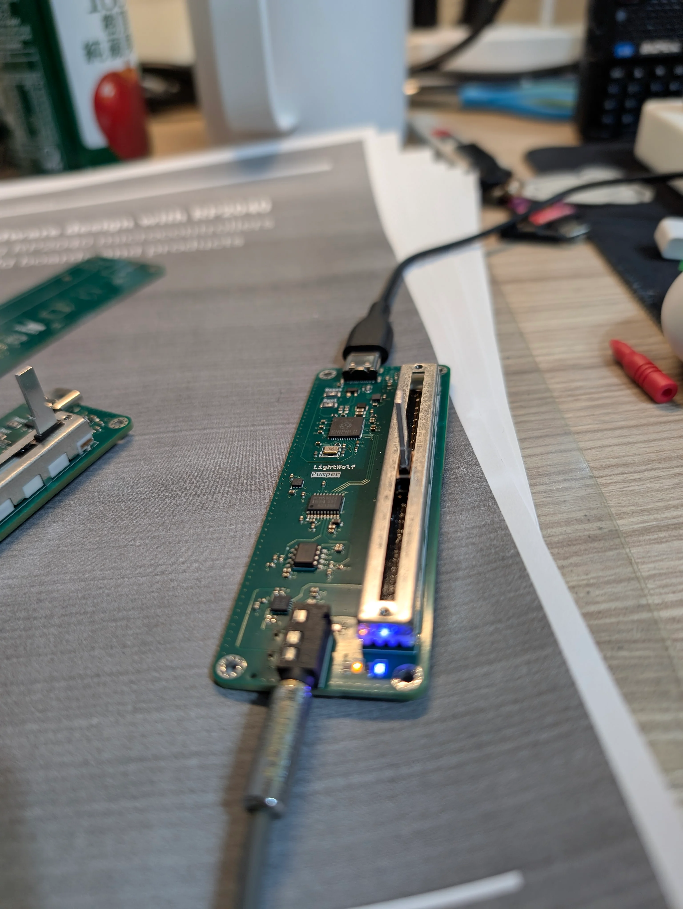

# Pumper

A USB DAC that uses RP2350 to pump audio data to a DAC chip. The board uses PCM5102A DAC with OPA1652 and OPA1622 as op-amp and headphone driver.

This is a experimental project to learn about USB audio and DAC design. The board is designed to be as simple as possible, with minimal components and a small form factor while trying to give best audio quality.

The RP2350 firmware exposes a ten-band parametric EQ over WebHID. The controller in [`web/`](web/) previews changes live, supports automatic clipping headroom, and writes the current profile to device flash only when requested.

## Building the firmware

Install CMake, Ninja, a host C/C++ compiler, and the Arm GNU embedded toolchain (`arm-none-eabi-gcc`). Clone the Pico SDK with its submodules, then run the following commands from the repository root:

```sh
export PICO_SDK_PATH="${HOME}/Projects/pico-sdk"

cmake -S firmware -B firmware/build -G Ninja \
  -DCMAKE_BUILD_TYPE=Release \
  -DPICO_BOARD=pico2 \
  -DPICO_PLATFORM=rp2350-arm-s \
  -DPICO_FLASH_SIZE_BYTES=2097152

cmake --build firmware/build --target rp2350_usb_dac -j
```

Flash `firmware/build/rp2350_usb_dac.uf2` through the RP2354 BOOTSEL drive. See [`firmware/README.md`](firmware/README.md) for SDK setup, the TinyUSB audio fix, clean rebuilds, flashing, tests, and troubleshooting.


---

Build result



## BOM

| Name         | Cost        |
| ------------ | ----------- |
| PCB Shipping | $6.12       |
| PCB Assambly | $86.18      |
| PCB          | $11.43      |
| **Total**    | **$103.73** |
